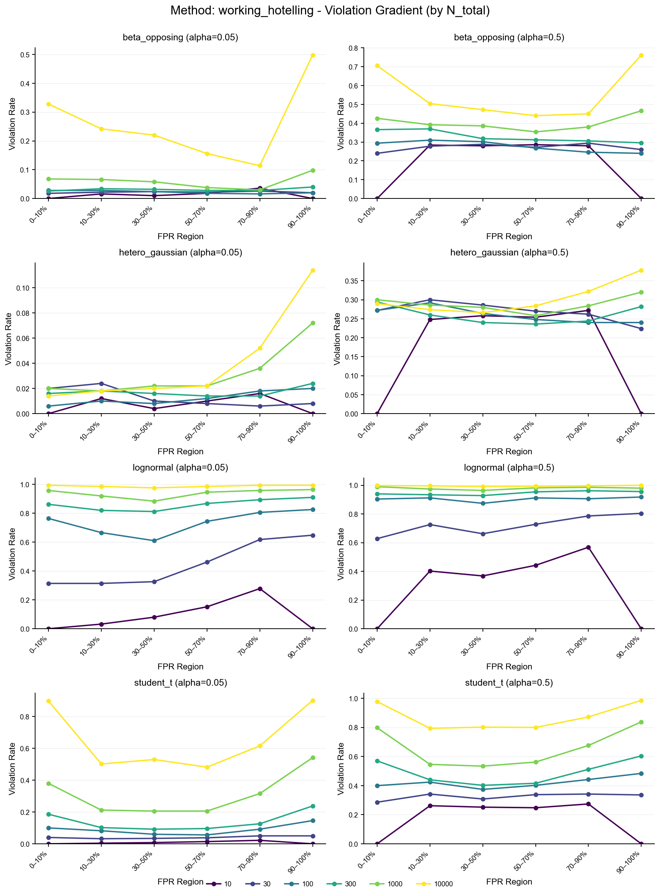
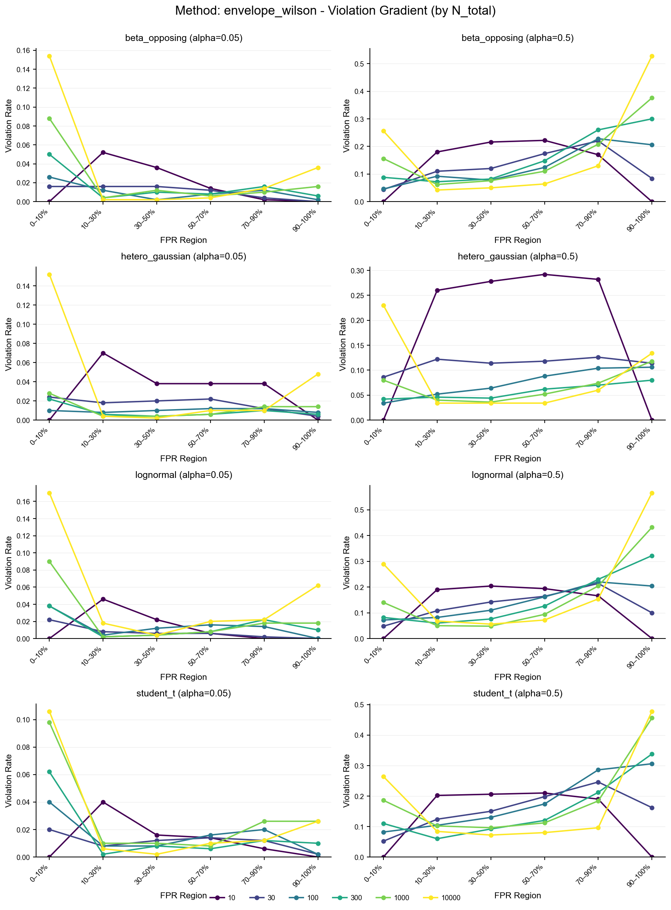
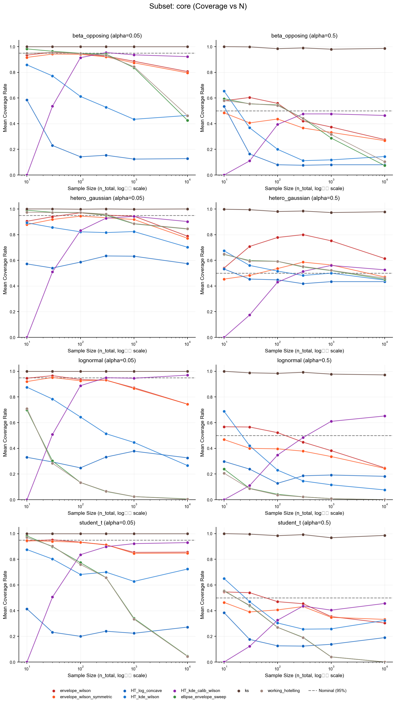
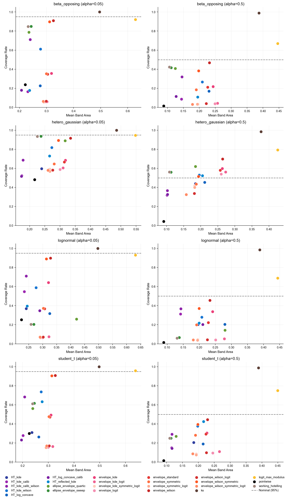

# ROC Confidence Band Methods: A Comprehensive Simulation Study

Code and analysis for evaluating simultaneous confidence bands for ROC curves under diverse distributional conditions.

## The Problem

Classical ROC confidence band methods (Working-Hotelling, Ellipse-Envelope) assume **binormal scores**—that both classes follow Normal distributions. Real-world classifiers, especially deep learning models, often produce heavy-tailed, skewed, or multimodal score distributions that violate this assumption.

This project evaluates **9 confidence band methods** across **18+ data-generating processes** spanning 8 distribution families, using **Latin Hypercube Sampling** to systematically explore the parameter space.

### Key Questions

1. How badly do classical methods fail when binormality is violated?
2. Can bootstrap methods achieve valid coverage across heavy-tailed, skewed, and multimodal distributions?
3. What is the width cost of distribution-free methods?

---

## Installation

Requires Python 3.12+ and UV package manager.

```bash
git clone https://github.com/ndelaneybusch/studroc_paper.git
cd studroc_paper
uv sync
```

---

## Methods

### Classical (Parametric)

| Method | Assumptions | Failure Mode |
|--------|-------------|--------------|
| **Working-Hotelling** | Binormal scores, equal variance | Catastrophic undercoverage on heavy-tailed data |
| **Ellipse-Envelope** | Binormal scores | Same as W-H, slightly more conservative |
| **Fixed-Width KS** | None (distribution-free) | Overconservative (>95% coverage even at nominal 50%) |
| **Pointwise Bootstrap** | Independence across FPR grid | Ignores multiplicity, very poor coverage, sets lower bound for width |

### Novel Bootstrap Methods

| Method | Key Innovation | Strengths |
|--------|----------------|-----------|
| **Studentized Bootstrap Envelope** | Modular boundary corrections (Wilson, KDE, log-concave) | Wilson floor prevents band collapse at upper bound |
| **Max-Modulus (Logit)** | Pure logit-space construction with Haldane correction | Aggressive variance stabilization, very conservative, wider even than KS |
| **Hsieh-Turnbull** | Asymptotic variance with density estimation | Near-optimal when log-concave assumption holds, but difficult to estimate |

### PyTorch Acceleration and Resource Optimization

All bootstrap methods use PyTorch for automatic GPU acceleration (10-50× speedup for B > 500).

**Transparent GPU acceleration:** Methods automatically detect and use CUDA devices. Inputs remain NumPy arrays (scikit-learn compatible), while computationally intensive operations run on GPU.

**Batched grid evaluation:** The `generate_bootstrap_grid` function processes bootstrap samples in memory-efficient batches, computing TPR values at grid points without materializing full score arrays. For each grid FPR value, it computes the threshold directly from bootstrap negative scores (via quantile), then counts positive scores exceeding that threshold—avoiding storage of complete empirical ROC curves for each replicate.

**Optimal B/K allocation:** Under compute constraints, the `optim_k_b.py` module balances bootstrap replicates (B) against grid resolution (K). Given memory budget C:
- **Full grid** (K = n₀+1 jump points): Zero discretization error, optimal when n₀ is small
- **Uniform grid** (K optimized): Balances bootstrap error β/√B with discretization error D/K

The allocation formula determines when full grid is optimal: (n₀+1)³ < 27D²C/(4β²). See `stats/optim_K_B.md` for derivation.


---

## Data-Generating Processes

The simulation uses a **generate-and-verify** approach: generate data from known distributions, derive the true population ROC analytically or numerically, then check whether confidence bands contain it.

| DGP | What It Tests | True ROC Method |
|-----|---------------|-----------------|
| Gaussian (equal var) | Baseline | Closed-form |
| Heteroskedastic Gaussian | Unequal variances | Closed-form |
| Log-Normal | Right skewness | Closed-form (after transform) |
| Beta (opposing skew) | Bounded support [0,1] | Numerical inversion |
| Student's t | **Heavy tails** (critical test) | Numerical inversion |
| Gamma | Right skewness, flexible shape | Numerical inversion |
| Bimodal Negative | Multimodality, ROC inflection | Numerical mixture inversion |
| Exponential | Bounded at zero | Closed-form (power function) |

---

## Simulation Design

**Latin Hypercube Sampling** with maximin optimization provides space-filling coverage of parameter combinations with 3-5× fewer samples than random sampling.

**Parameter ranges:**
- AUC ∈ [0.55, 0.99]
- Distribution-specific shape parameters (e.g., df ∈ [1.1, 30] for Student's t)

**Sample sizes:** n ∈ {10, 30, 100, 300, 1000, 10000} per class, plus imbalanced designs (1%, 10%, 50% prevalence at n=1000).

**Scale:** 6 DGPs × 8 sample configs × 1000 LHS combinations × 24 method variants = **1.15M evaluations** per confidence level.

---

## Key Findings

### 1. Binormal methods fail catastrophically on heavy-tailed data

Working-Hotelling and Ellipse-Envelope drop to **near 0% coverage** at n=10,000 for Student's t and lognormal distributions. They converge to the wrong curve.



### 2. Bootstrap methods with Wilson variance floor achieve robust coverage

The Wilson floor prevents band collapse at upper tail, maintaining ~90% coverage across distributions (vs. 100% for KS, but with nearly half the width). However, lower tail still has pathologies (most remaining violations are below the lower bound in the lower tail).





- Bootstrap methods approach nominal coverage, still accrue violations in the lower tail as n increases, but more slowly than binormal methods. 
- Bootstrap-calibrated Hsieh-Turnbull is catastrophic at low n but asymptotically ideal at high n (n > 300) across all distributions.

### 3. Coverage-width tradeoffs



- **Binormal-compatible data:** Working-Hotelling is optimal
- **Heavy-tailed data:** Bootstrap+Wilson achieves valid coverage at ~half KS width
- **Lognormal:** Binormal methods perform worse than pointwise intervals

---

## Usage

```bash
uv run python scripts/run_simulation.py \
  --dgp student_t \
  --n_total 1000 \
  --n_lhs 1000 \
  --output_dir data/results \
  --seed 42
```

Results are saved as JSON with coverage rates, confidence intervals, band widths, and violation statistics.

---

## Repository Structure

```
studroc_paper/
├── src/studroc_paper/
│   ├── datagen/       # DGPs and true ROC derivation
│   ├── methods/       # Confidence band implementations
│   ├── eval/          # Coverage and width metrics
│   ├── sampling/      # Maximin LHS
│   └── viz/           # Diagnostic and aggregate plots
├── scripts/           # Simulation drivers
├── data/results/      # Aggregated JSON results
└── figures/           # Visualization outputs
```

---

## Development

```bash
uv run pytest              # Tests
uv run ruff check --fix .  # Lint
uv run ruff format .       # Format
uv run mypy src/studroc_paper  # Type check
```

---

## Citation

```bibtex
@misc{studroc2025,
  author = {Delaney-Busch, Nathaniel},
  title = {ROC Confidence Band Methods: A Comprehensive Simulation Study},
  year = {2025},
  publisher = {GitHub},
  url = {https://github.com/ndelaneybusch/studroc}
}
```