# A Distribution-Free Confidence Band for the ROC Curve

A simultaneous confidence band for the **true population ROC curve** that is
genuinely distribution-free, far more informative than the textbook
distribution-free band, and well calibrated across heavy-tailed, skewed, and
multimodal score distributions where the classical parametric bands fail.

The method — a **studentized bootstrap envelope** with two exact tail floors —
is specified in [`stats/nonparam_envelope.md`](stats/nonparam_envelope.md), its
expected behavior is derived in
[`stats/theoretical_behavior_report.md`](stats/theoretical_behavior_report.md),
and every figure below is produced from a 2.25M-evaluation simulation study
spanning seven data-generating processes, six sample sizes, and three
confidence levels.

---

## 1. The problem with the methods we have

If you want a band around an ROC curve today, you essentially choose between two
families, and both have a fatal flaw.

**Working–Hotelling (and its ellipse-envelope refinement) assume the scores are
binormal.** The construction parametrizes the ROC as
`TPR = Φ(a + b·Φ⁻¹(FPR))` and lays a hyperbolic regression band around it in
probit–probit space (Ma & Hall 1993; Working & Hotelling 1929). When both class
score distributions really are Gaussian, this is excellent: tight bands, correct
coverage. When they are not, the band converges confidently to *the wrong
curve*. Worse, the failure scales with sample size — more data tightens the band
around a biased estimate, so coverage drops toward zero exactly when you trust
the result most.

**The Kolmogorov–Smirnov / DKW fixed-width band is distribution-free but
uninformative.** It places a constant-width strip of half-width
`ε = √(ln(2/α)/(2n))` around the curve (Campbell 1994; Dvoretzky–Kiefer–
Wolfowitz 1956; Massart 1990). It never fails to cover — but it covers *too
much*. The 50% band is nearly as wide as the 95% band, the strip has the same
width at the steep low-FPR corner as in the flat interior, and it tells you
almost nothing about *where* the true curve actually lies. It is a safety
benchmark, not an answer.

What is actually needed is a band that is (i) **distribution-free**, like KS,
making no parametric commitment about the score distributions; (ii)
**substantially more informative than KS**, with width that adapts to where the
uncertainty really is; and (iii) **well calibrated across diverse distribution
families**, holding coverage near nominal whether the scores are Gaussian,
heavy-tailed, skewed, or multimodal.

### Why "alternative distributions" is the realistic case, not the exotic one

Binormality is the exception, not the rule, for modern classifiers:

- **Heavy tails.** Deep network logits and many calibrated probability outputs
  have far heavier tails than a Gaussian; a handful of extreme-confidence
  predictions dominate the low-FPR corner of the ROC, which is precisely where
  parametric bands are most fragile.
- **Skew and bounded support.** Probability outputs live in `[0, 1]` and pile up
  near the boundaries; risk scores are often right-skewed. Neither is Gaussian on
  any scale. Experienced practitioners will use classifier logits instead of 
  probabilities, but it can be easy to miss because the choice doesn't impact
  the ROC curve, but it profoundly impacts the WH confidence band around that curve.
- **Multimodality.** When a population mixes subgroups — easy vs. hard cases,
  multiple disease subtypes, distinct fraud patterns — the negative or positive
  score distribution is multimodal, producing genuine inflections in the ROC that
  no binormal model can represent.

---

## 2. How badly the classical bands fail

The contrast is stark. The heatmaps below show coverage minus the 0.95 nominal
target: white is perfect, blue is conservative, red is undercoverage.

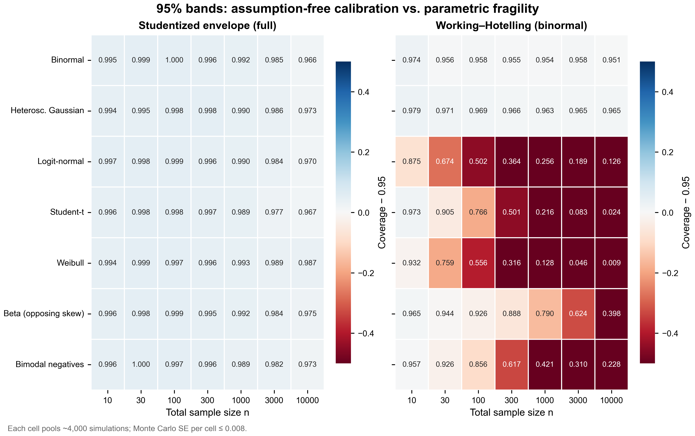

The studentized envelope (left) is at or slightly above nominal for **every**
distribution at **every** sample size. Working–Hotelling (right) is fine on the
two binormal-compatible families (Binormal, Heteroscedastic Gaussian) but turns
deep red everywhere else, and the red *deepens with n*: on Student-t data its
coverage falls to 0.02 at n = 10,000, on Logit-normal to 0.13, on Bimodal
negatives to 0.23. The parametric band does not merely lose efficiency
off-model — it loses validity, catastrophically and irreversibly.

This is not a knife-edge that only trips on pathological data. It is a smooth,
continuous collapse as the data drift away from binormality:

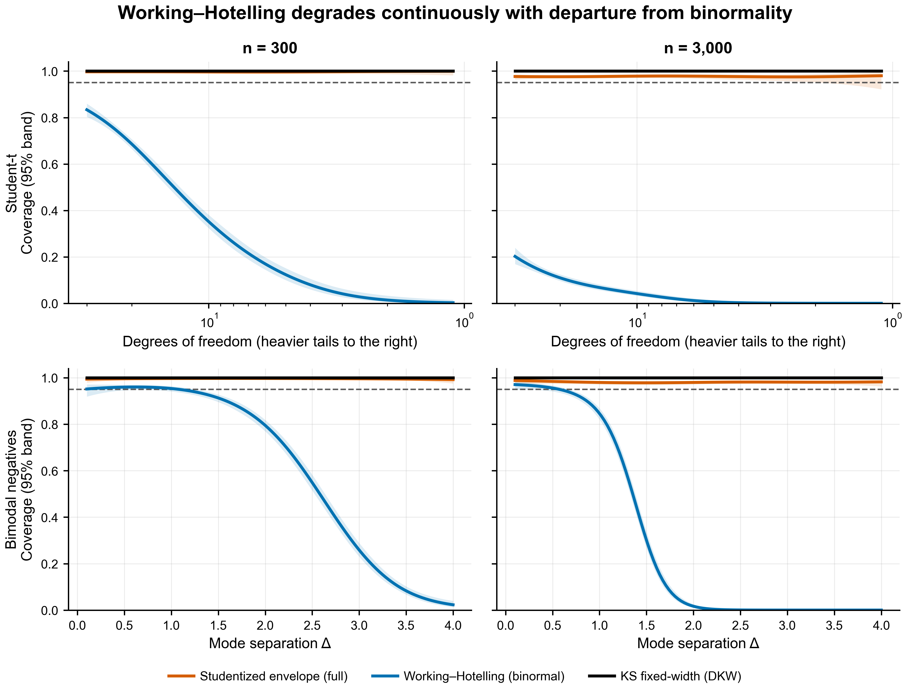

As Student-t tails get heavier (degrees of freedom decreasing, top row) or the
negative class becomes more clearly bimodal (mode separation increasing, bottom
row), Working–Hotelling coverage slides continuously from acceptable to near
zero, and the larger sample size (right column) makes it *worse*. The envelope
and KS bands ride flat along the top throughout. There is no safe operating
region for the parametric band defined by a simple diagnostic — any departure
from binormality is paid for in coverage.

---

## 3. The case for the envelope: coverage *and* tightness, on every family

The right way to judge a band is jointly on coverage (must be ≥ nominal) and
width (smaller is better). The figures below plot per-DGP coverage against mean
band area with 95% confidence intervals, for three sample sizes (rows) and the
three distribution families.

**Gaussian-like distributions** (the home turf of the parametric methods):

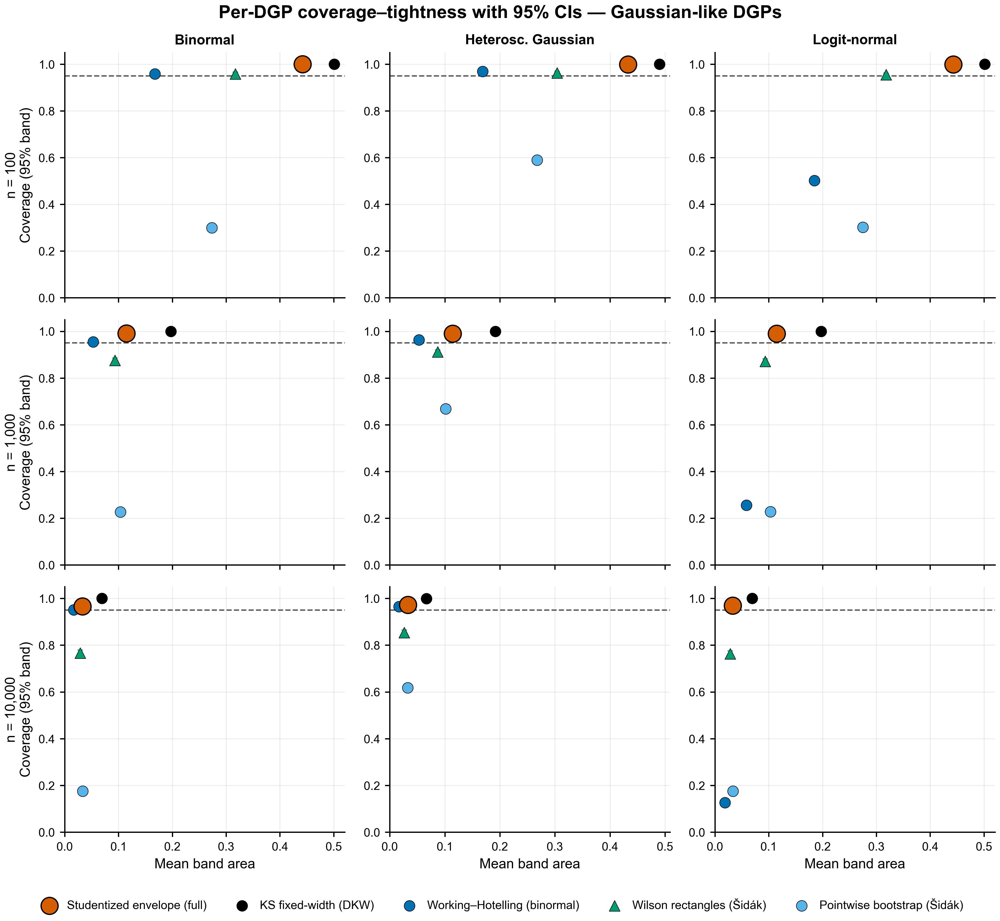

**Heavy-tailed / skewed distributions:**

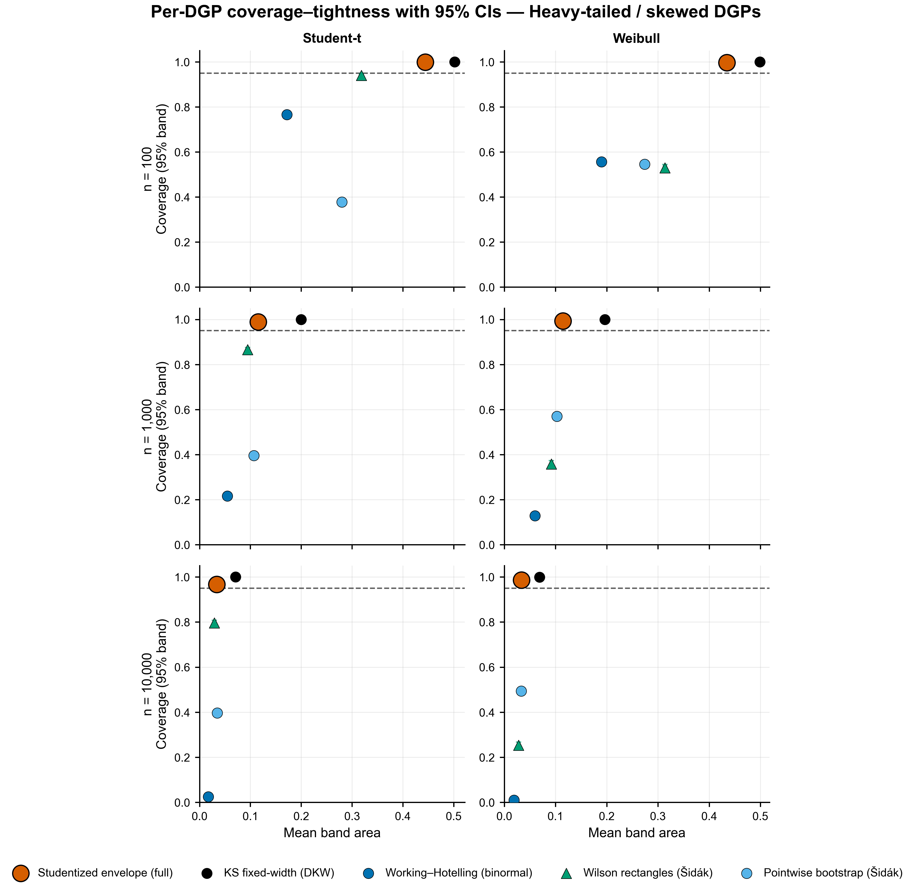

**Non-standard shapes (bounded support, multimodal):**

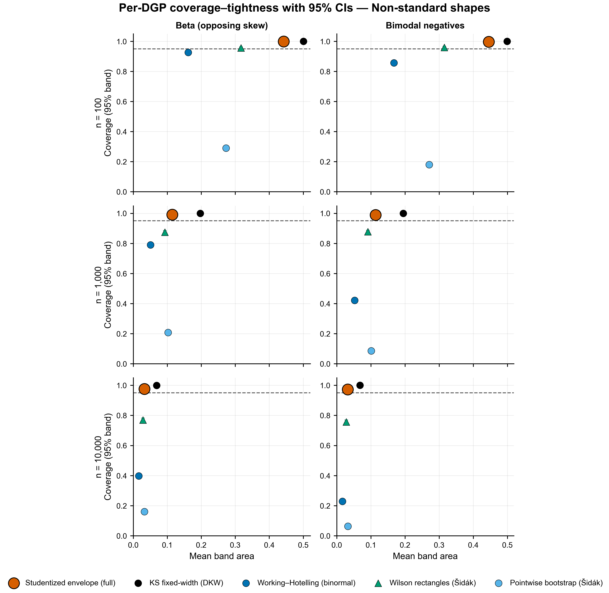

Reading these together, the studentized envelope (orange) is the only method
that stays pinned at or just above the 0.95 line *in every panel*, while sitting
well to the left of KS (black) — i.e. tighter. The competitors each fail a
requirement:

- **KS (black)** is always at ~1.0 coverage but always the widest point — safe
  but uninformative, exactly as designed.
- **Working–Hotelling (dark blue)** is competitive only on Gaussian-like data,
  and even there its coverage falls off the bottom of the plot as n grows; on
  heavy-tailed and non-standard data it is near the floor.
- **Wilson rectangles (green)** are tight and well-calibrated at small n but
  drift below nominal as n increases (the Šidák correction mishandles many
  correlated grid points).
- **Pointwise bootstrap (light blue)** ignores multiplicity entirely and
  under-covers everywhere.

Only the envelope occupies the desirable corner — high coverage, modest width —
across all three families and all sample sizes.

---

## 4. How the method works

The band is built in three layers, each carrying a different channel of
uncertainty. The full specification is in
[`stats/nonparam_envelope.md`](stats/nonparam_envelope.md); the sketch:

1. **A studentized bootstrap envelope (the interior).** Resample negatives and
   positives with replacement, recompute the ROC for each of `B` bootstrap
   replicates, and measure how "strange" each replicate is by its maximum
   *studentized* deviation from the empirical curve — the pointwise deviation
   divided by the local bootstrap standard error, maximized over the FPR grid.
   Retain the `(1−α)` fraction of curves with the smallest such supremum
   deviation, and take their pointwise min/max. Studentization makes the band
   adapt to local variance — tight near the corners, wider in the high-variance
   middle — and the envelope is naturally asymmetric, because the bootstrap
   distribution itself is asymmetric near the boundaries. This is the inversion
   of a bootstrap supremum statistic (Hall & Horowitz 2013), and it is correct
   in the *interior* of the curve.

2. **A Wilson rectangle floor (the TPR plateau).** Near FPR = 1 the empirical
   TPR sits on a plateau at ~1 and the bootstrap variance collapses to zero — the
   envelope would pinch shut and fail to cover. Where the bootstrap variance
   falls below the binomial (Wilson score) variance, the band is floored by a
   Šidák-corrected Wilson rectangle. At the plateau the slope is ~0, so binomial
   TPR uncertainty is the *complete* uncertainty model, and the Wilson floor is
   exactly right.

3. **An exact Beta order-statistic floor (the steep low-FPR corner).** At the
   first few grid points of a steep curve the dominant uncertainty is
   *horizontal* — the true FPR of the operating threshold, which is an extreme
   order statistic of the negatives. No variance-based yardstick can see this,
   and the bootstrap cannot resample beyond the observed extremes. But there is
   one exact, finite-sample, distribution-free law available: for continuous
   scores the true FPR exceedance at the j-th largest negative score is
   `Beta(j, n₀+1−j)`, regardless of the score distribution (probability integral
   transform). The lower band is floored using this law (David & Nagaraja 2003),
   which repairs the corner exactly where the bootstrap and asymptotic arguments
   both break down. Below FPR ≈ 7/n₀ it is honestly vacuous — no distribution-
   free lower bound exists there, and the band says so rather than overclaiming.

The three layers barely overlap: each carries the uncertainty channel the others
cannot see. The figure below shows the assembled band on nine example datasets
(n = 300, three target AUCs × three Gaussian-like DGPs), with the regions
color-coded by which mechanism set the lower bound:

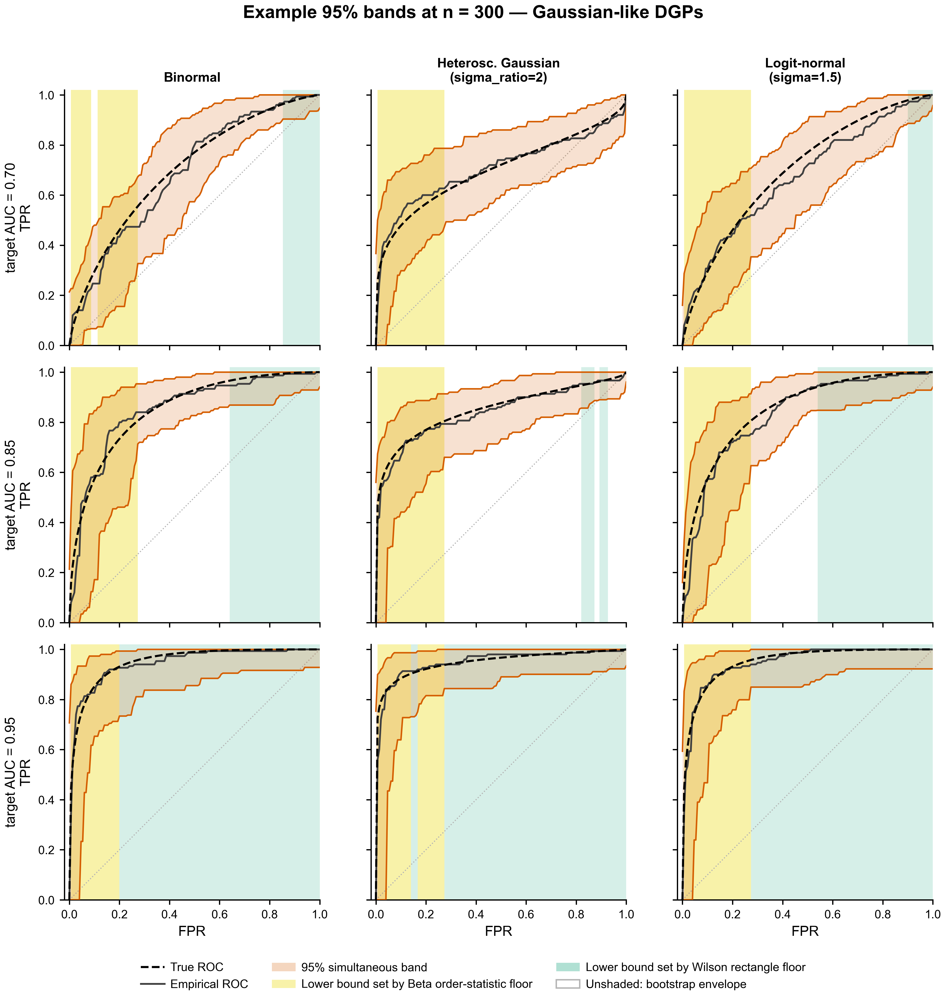

The orange band tracks the true curve (dashed) closely. The **yellow** region at
low FPR is where the **Beta order-statistic floor** sets the lower bound; the
**green** region near the plateau is where the **Wilson rectangle floor** sets
it; the **unshaded** interior is the **bootstrap envelope**. As the target AUC
rises (top to bottom) the curve steepens and the Beta floor's jurisdiction at
the low-FPR corner does more of the work — exactly the regime where every other
method fails.

---

## 5. The properties that make it trustworthy

**Stable across AUC.** Coverage holds near or above nominal across the full
range of true AUC, for every DGP and sample size — it does not degrade as the
curve gets steeper:

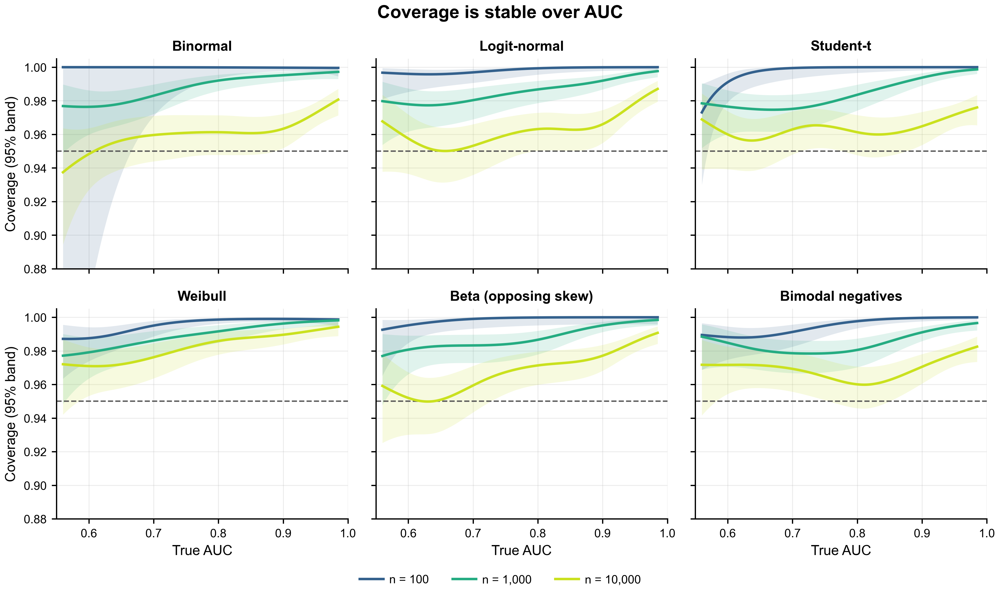

**Stable across distribution shape.** Sweeping each DGP's shape parameter — tail
heaviness, skew strength, variance ratio, mode separation, mixture weight —
leaves coverage essentially flat above the nominal line:

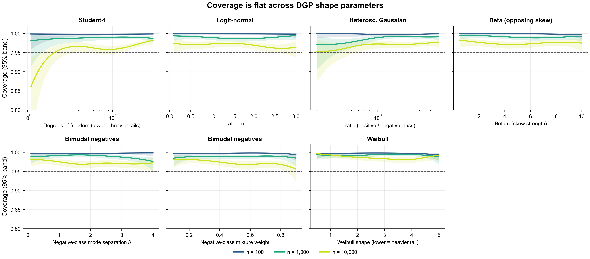

**Stable across sample size, where competitors are not.** This is the decisive
comparison. The envelope (orange) holds calibration across all six sample sizes
on all seven families, while Working–Hotelling (blue) collapses with n on every
non-binormal family and the Wilson rectangles (green) drift down everywhere:

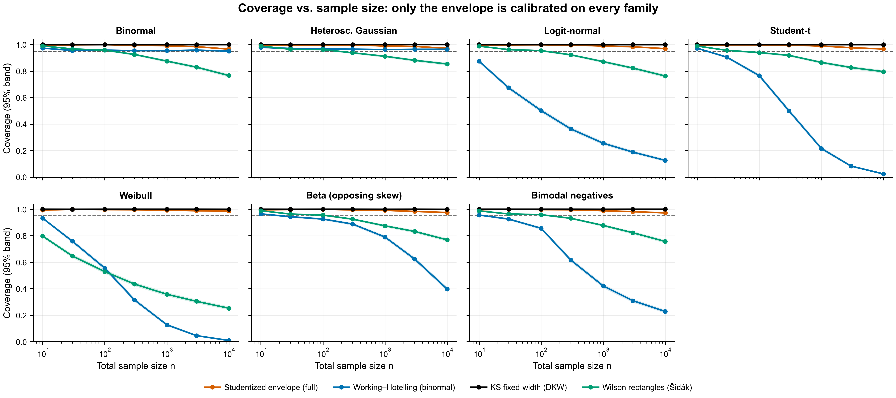

**Far tighter than KS, while staying calibrated.** Plotting band area on a
WH-to-KS scale (1.0 = KS, the widest distribution-free band; 0 = WH, the
tightest parametric band), the envelope's area falls from 90% of KS at n = 10 to
31% at n = 10,000 — it buys most of KS's safety at roughly a third of the width
— while its calibration error (right panel) stays flat near the ideal, unlike
WH and the rectangles, whose errors explode with n:

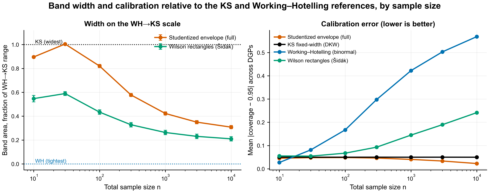

**When it misses, it misses small.** No finite-sample method is perfect, but the
envelope's residual violations are tiny: the conditional miss depth is almost
always well under a few points of TPR (left), and the 99th-percentile worst
violation stays near zero across all sample sizes, where Working–Hotelling and
the rectangles climb to 0.7–0.85 (right):

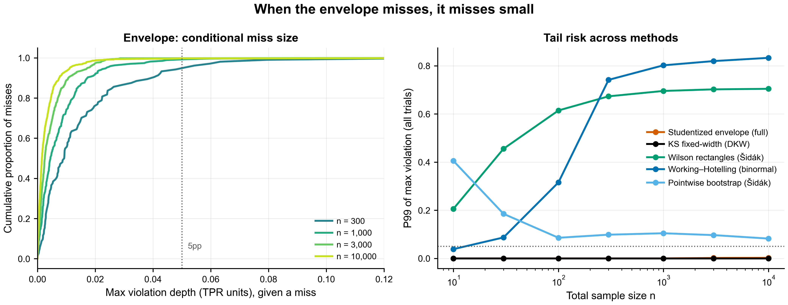

---

## 6. Ablations: every component is load-bearing

The hybrid is not over-engineered — removing any single piece breaks the band in
a specific, predictable way.

**Without the floors, the bare bootstrap envelope is not a valid band at all.**
It fails at both corners — the collapsed-variance plateau and the steep low-FPR
corner — covering only ~25–35% of the time. The full method repairs both:

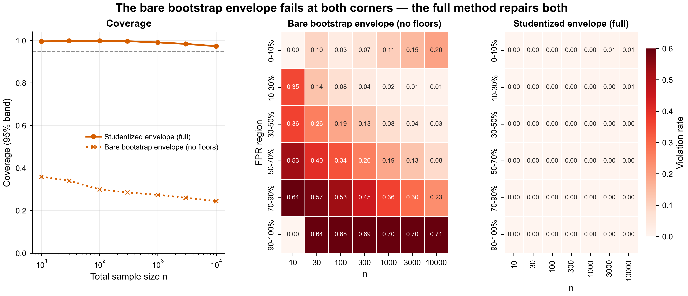

**The two floors own different corners.** Dropping the Beta floor reopens the
steep low-FPR corner (and the damage concentrates at high AUC, where that corner
matters); dropping the Wilson floor reopens the plateau corner, with violation
rates there climbing to ~0.7. Each floor is necessary for its own region:

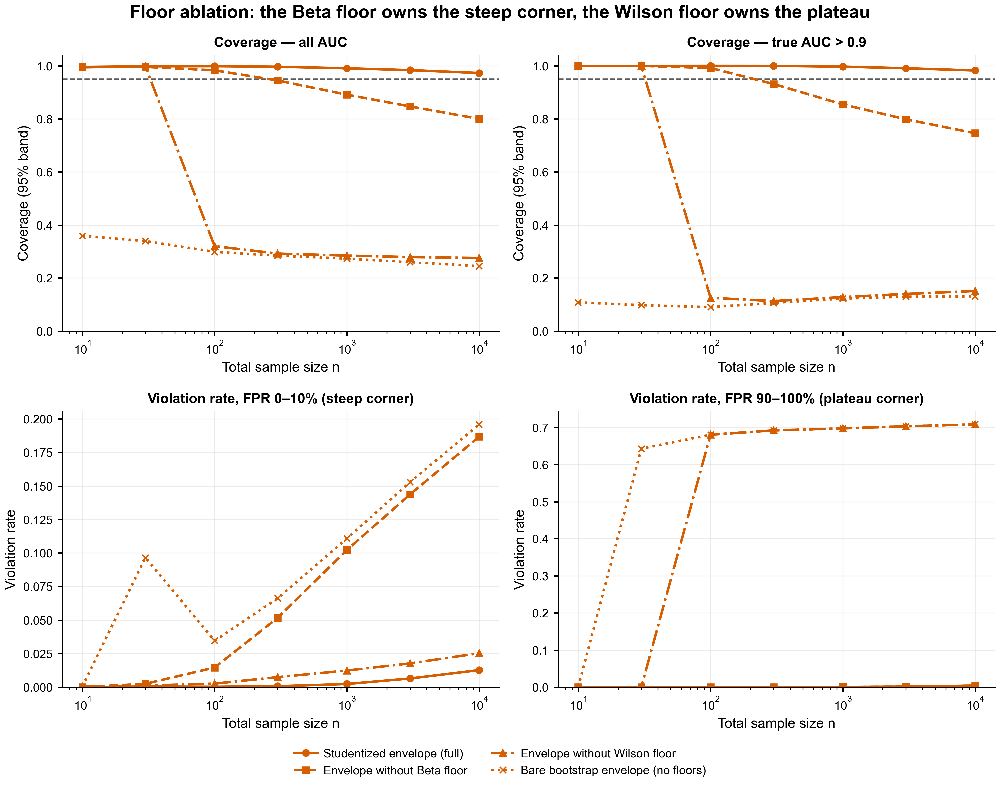

**Neither floor alone suffices.** A Beta-only band leaves an unprotected gap just
beyond the Beta floor's fixed-k jurisdiction; a Wilson-only band buys low-FPR
coverage only by inflating the band to vacuous widths there. The hybrid is the
one configuration that is neither leaky nor vacuous:

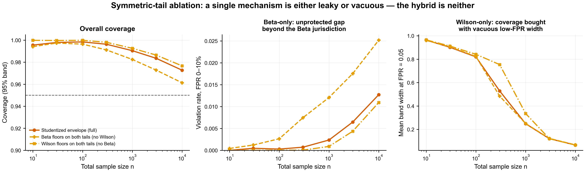

**The bootstrap interior earns its place too.** Replacing the bootstrap interior
with the floors alone yields a band that is safe at 95% but neither tight nor
tunable — it over-covers badly at the 50% level and runs wider than the full
method. The studentized bootstrap is what gives the interior its adaptive,
informative width:

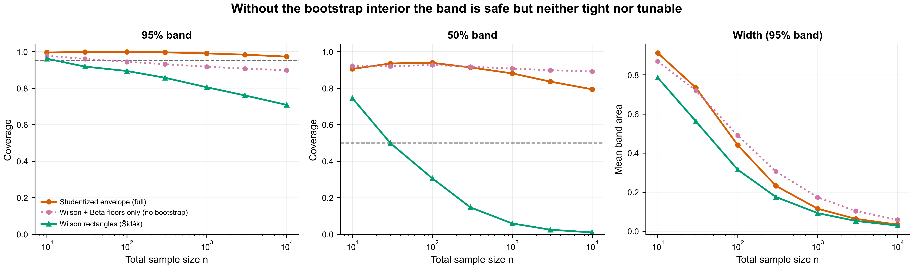

---

## 7. What the theory says to expect

The full account is in
[`stats/theoretical_behavior_report.md`](stats/theoretical_behavior_report.md);
the essential predictions, all confirmed in simulation:

- **Asymptotic validity in the interior, exact finite-sample floors at the
  boundary.** The empirical ROC process converges weakly to a Gaussian process
  (Hsieh & Turnbull 1996), and the studentized bootstrap inverts a supremum
  statistic over it — but the argument holds only on compact subintervals of
  `(0,1)`. At the *moving* boundary grid points `t = k/n₀` (fixed small k) the
  relevant quantities are extreme order statistics, not empirical-process
  averages: the Gaussian approximation does not apply, the bootstrap support is
  one-sided, and the empirical ROC is upward-biased by order-statistic geometry.
  The Beta floor is built precisely for these points, where its guarantee is
  finite-sample and distribution-free rather than asymptotic.
- **The two corners are governed by two different, complementary models.** At the
  TPR plateau the curve is flat, so binomial (Wilson) variance is the complete
  model. At the steep low-FPR corner the Hsieh–Turnbull slope term
  `(g/f)²·t(1−t)/n₀` dominates and binomial variance is 3–6× too small — only the
  order-statistic floor recovers it. This is why a single mechanism cannot work.
- **Coverage degrades with AUC, and the real risk factor is early slope.** A
  steep low-FPR rise converts threshold-location error into large vertical
  misses; flat curves near the origin cost little. The Beta floor targets exactly
  this regime, raising coverage on the previously failing high-AUC strata from
  ~0.77–0.84 to 0.95–0.99.
- **It is a high-confidence tool.** A supremum-calibrated simultaneous band is
  inherently insensitive to α (the 0.95-vs-0.50 critical-value ratio is only
  ~1.3–1.5×), so the band over-covers at low confidence levels. This is a
  property of sup-norm simultaneity, not of the envelope specifically — use it
  near 95%, not at 50%.
- **The honest limitation is informativeness, not validity.** The lower band is
  vacuous below FPR ≈ 7/n₀ because no distribution-free lower bound exists there.
  Applications that need guarantees at lower FPR must size n₀ accordingly — but
  the band declines to certify what cannot be certified, rather than overclaiming.

---

## Installation

Requires Python 3.12+ and the [uv](https://docs.astral.sh/uv/) package manager.

```bash
git clone https://github.com/ndelaneybusch/studroc_paper.git
cd studroc_paper
uv sync
```

All bootstrap methods use PyTorch for automatic GPU acceleration (10–50× speedup
for `B > 500`); inputs remain NumPy arrays for scikit-learn compatibility.

## Reproducing the figures

```bash
uv run python stats/paper_figures.py
```

Figures are written to `figures/paper/`. The underlying simulation is driven by
`scripts/run_simulation.py` over the data-generating processes in
`src/studroc_paper/datagen/` and the methods in `src/studroc_paper/methods/`.

## Repository structure

```
studroc_paper/
├── src/studroc_paper/
│   ├── datagen/       # DGPs and true-ROC derivation
│   ├── methods/       # Confidence band implementations (envelope_boot.py, ...)
│   ├── eval/          # Coverage and width metrics
│   ├── sampling/      # Maximin Latin Hypercube Sampling
│   └── viz/           # Diagnostic and aggregate plots
├── scripts/           # Simulation drivers
├── stats/             # Method spec, theory, and figure generation
├── data/results/      # Aggregated simulation results
└── figures/           # Visualization outputs
```

## Development

```bash
uv run pytest                  # Tests
uv run ruff check --fix .      # Lint
uv run ruff format .           # Format
uv run mypy src/studroc_paper  # Type check
```

## Citation

```bibtex
@misc{studroc2025,
  author    = {Delaney-Busch, Nathaniel},
  title     = {A Distribution-Free Confidence Band for the ROC Curve},
  year      = {2025},
  publisher = {GitHub},
  url       = {https://github.com/ndelaneybusch/studroc_paper}
}
```
